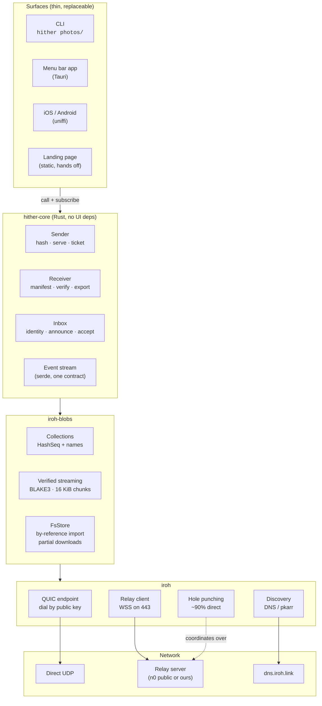
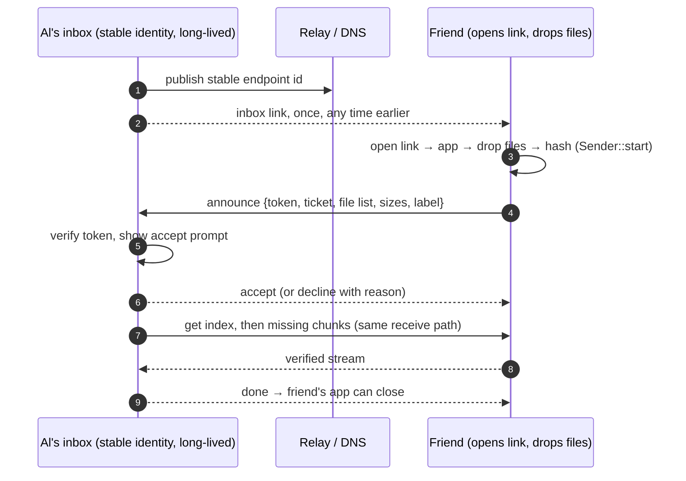
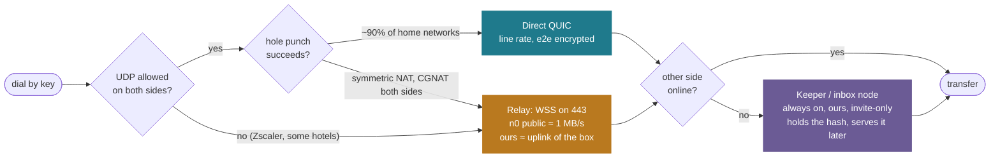
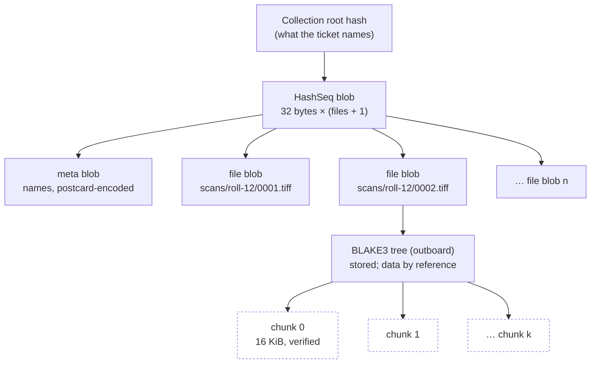
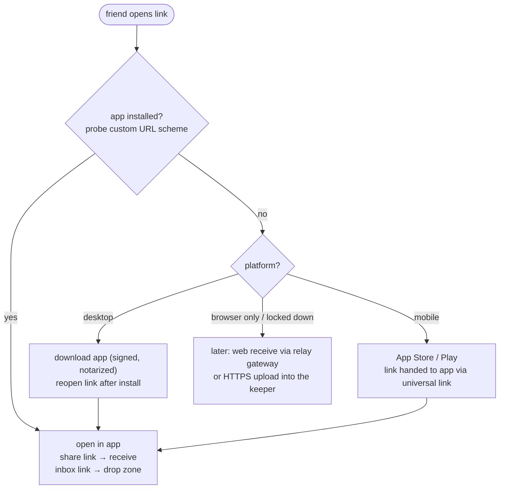
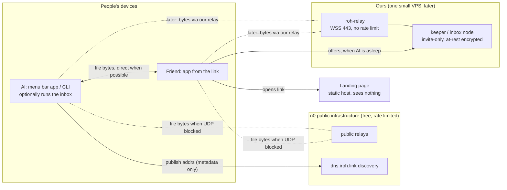

# Architecture

Review draft, 2026-09-13. Companion to `NOTES.md` (state and next steps) and
`docs/landscape.md` (transports and how other tools work). Diagrams are
Mermaid; GitHub renders them inline.

**Thesis.** One content-addressed core, reached through whichever surface the
person already has, over the best path the network allows: direct when it
can be, our own relay when it cannot, our own always-on node when the other
side is asleep. The person never sees any of those words.

## 1. The shape



*Everything above `hither-core` is a rendering of the same event stream.
Everything below it is n0's, and we hold it at arm's length behind the core's
API so a future iroh change touches one crate.*

## 2. Design decisions

Each is a choice we could have made differently. The "because" is the reason;
the "so" is what it costs or buys.

**One core, many faces.** `hither-core` has no terminal or UI dependency and
emits a serialisable `Event` stream. *Because* the previous attempt (Ginseng)
welded Tauri IPC types into the core and had to be thrown away. *So* CLI,
desktop, mobile and web are thin renderers, and the core is testable headless.

**Content addressing is the identity of a share.** A share *is* a BLAKE3 hash
of a collection. *Because* it gives verification, resume, deduplication and
"anyone who has it can serve it" for free. *So* there is no zip, no
"was it corrupted?", and a keeper node is just another holder of the hash.

**Files are imported by reference, exported by rename.** The sender's store
holds hash trees, not copies; the receiver's partial store sits beside the
destination so the final step is a rename. *Because* 10 GB of TIFFs must not
be copied twice. *So* a `.hither-partial-<hash>` directory appears next to the
destination during a download and vanishes on success.

**Direct, then our relay, then our node.** A three-rung connectivity ladder.
*Because* ~90% of home networks hole-punch, ~10% need a relay, and managed
corporate networks (Zscaler) drop UDP entirely. *So* we run a relay; it is a
product component, not a fallback, and the UI says which rung it is on.

**Links are capabilities carried in the URL fragment.** `https://host/#…`
*Because* the fragment never reaches the server, so the landing page host
learns nothing. *So* one static page serves every link, and anyone holding a
link can use it: share links to pull, inbox links to offer.

**Two flows, same primitives.** `hither <paths>` (sender-initiated) and
`hither inbox` (receiver-initiated). *Because* the person who wants the files
is the one willing to install software; the friend should only open a link.
*So* the inbox needs a persisted identity and a small announce protocol, and
the sender side of an inbox transfer is literally `Sender::start` plus one
message.

**Never overwrite, never lose progress.** Collision check before the first
payload byte; partial data kept on failure, discarded only when it holds
nothing. *Because* trust in a transfer tool dies the first time it clobbers a
file or restarts a 5 GB download. *So* "run the same command again" is the
whole recovery story.

**No accounts.** Identity is a keypair; ephemeral by default, persisted for
an inbox. *Because* sign-up is the friction that makes people give up and use
whatever they already have. *So* there is no server-side user state at all.

**Honest about the path.** Direct or relayed, speed, and why. *Because* a
relayed transfer at 1 MB/s looks like a bug unless the tool says "your
network blocks direct connections". *So* a `doctor` command and a one-line
notice are in the roadmap, and never an evasion of network policy.

**Storage only when we own it.** No third-party storage by default. When a
keeper node exists it is ours, invite-only, and can be zero-knowledge with an
at-rest key in the link. *Because* Firefox Send died of anonymous abuse and
OneDrive is the thing we are replacing.

## 3. The two flows

### Sender-initiated: `hither photos/`

```mermaid
sequenceDiagram
    autonumber
    participant S as Sender (friend's machine)
    participant R as Relay / DNS (n0 or ours)
    participant D as Receiver (Al)
    S->>S: hash files by reference, build collection
    S->>R: connect to home relay, publish addrs
    S-->>D: ticket or link (chat, QR, clipboard)
    D->>R: dial sender's key
    R-->>S: coordinate hole punch
    S-->D: direct QUIC path (or relay if punching fails)
    D->>S: get collection index + names (tiny)
    D->>D: show file list, check for collisions
    D->>S: get missing chunks
    S-->>D: BLAKE3-verified stream, resumable
    D->>D: rename verified files into place
    D-->>S: close; sender sees "received everything"
```

### Receiver-initiated: `hither inbox`



What changes between them is only *who runs the long-lived node* and *where
the accept step sits*. The hashing, serving, verified download and export are
the same code. The inbox adds identity persistence, a 128-bit token, and one
length-prefixed announce message on a custom ALPN.

Why announce-then-pull rather than iroh-blobs `Push`: the receiver decides
before bytes move, the blobs protocol needs no access control, and the
existing download path is reused unchanged.

## 4. The connectivity ladder



*Observed on the work Mac: UDP blocked by Zscaler, so every transfer took the
amber rung at 993 KiB/s through n0's public relay. The same 119 MiB tree over
a direct path on a LAN should take about a second.*

## 5. Link anatomy

Today's share link, as printed by the CLI (209 characters):

```
https://host/#blobadvmvtfbmio7nvq4m7knoeikvdsdem7zkvrwzqx63xajzrwggshukajdnb2…
              │   └────────────── base32 BlobTicket ──────────────────────────┘
              └─ fragment: never sent to the host
```

| Field inside the ticket | Size | Why it is there |
|---|---|---|
| endpoint id (sender's public key) | 32 bytes | who to dial; also the TLS identity |
| relay URL | ~30 bytes | where to meet if punching fails |
| direct addresses | 6–18 bytes each | LAN and public IPs to try first |
| collection hash | 32 bytes | what to fetch, and how to verify it |
| format | 1 byte | "this is a collection", so the receiver expects names |

`--short` drops the addresses and leans on DNS discovery (139 characters).
An inbox link is the same idea with a different prefix and a token:
`#inbox:<endpoint id>:<token>[:relay]`. Neither kind is a decryption key;
both are permission to connect to one specific public key.

## 6. Data model



*The receiver fetches `seq` and `meta` first (a few hundred bytes), which is
enough to show the file list and refuse collisions. Everything after that is
`local.missing()`: iroh-blobs computes exactly which chunks are absent, which
is why resume costs nothing to implement.*

## 7. Reducing friction

The person we are asking a favour of is the sender. Every step they must take
is a chance to give up and use OneDrive. Where the friction sits today, in the
current CLI, and at the target:

| Step | OneDrive today | CLI v1 | Target |
|---|---|---|---|
| Package | zip 5 GB, wait | none | none |
| Upload | wait for full upload | none | none |
| Hand over | copy link | copy ticket | link already on clipboard, or drop into inbox |
| Install | account + browser | install a CLI | one-time app install from the link |
| Stay online | no | yes, until done | yes, until done; keeper removes this later |
| Download | one fragile HTTP stream | verified, resumable | same |
| Unpack | Archive Utility, error 79 | files land in place | same |
| Verify | hope | by construction | same |

The landing page is where install friction is paid, once:



Everything the friend sees is a page, a button, and a drop zone. The word
"peer", "ticket", "relay" or "hash" never appears in that path.

## 8. UX principles

- **Speak in outcomes.** "Sending 214 photos to Al" not "serving collection".
  "Al has everything" not "connection closed". Buttons say what happens.
- **Progress is per file and total, with a truthful ETA.** People need to
  know whether to leave the laptop open. Show files done / total, bytes, speed,
  and the path in plain words: "direct" or "via relay".
- **Every state has a next action.** Sender left: "Ask them to reopen the
  link; you will pick up where you stopped." Network blocks UDP: "Your network
  blocks direct connections. Sending via relay at 8 MB/s." Collision: "photos/
  already exists here. Choose another folder."
- **Interruptions are not errors.** Ctrl-C, sleep, Wi-Fi change: the message
  is "paused" and the recovery is "run it again".
- **Safety prompts carry the decision.** An inbox offer shows who (label and
  short id), what (file list), how much (size), and the two verbs. "Always
  accept from this sender" is one checkbox. Rotating the inbox link is one
  action.
- **Same link, every device.** A link pasted into a phone, a terminal, a menu
  bar app or a browser does the right thing for that surface.
- **Quiet when it works.** The menu bar app's happy path is a drop, a copied
  link, and a notification when the other side has everything.

## 9. Deployment



*Solid lines carry file bytes between the two people. Dashed lines carry file
bytes through a relay that cannot read them. The landing page and DNS carry no
file data at all. Nothing here requires an account.*

## 10. Phases

The order is a dependency order, so the numbers mean something.

1. **CLI, synchronous.** Done. Verified end to end; direct path unverified
   only because of the work Mac's network.
2. **Name, identity, doctor.** Done. `hither`; `hither id` persists a
   keypair; `hither doctor` reports UDP, NAT type, public address, relay
   reachability and the addresses a ticket would carry, with a plain-language
   verdict; iroh's platform TLS verifier is on so corporate CAs work.
3. **Inbox.** Token, announce protocol, accept prompt, `hither inbox` and
   `hither to <inbox-link> <paths>`.
4. **Landing page and owned relay.** Static page that hands off to the app;
   one `iroh-relay` on a VPS; measure relayed throughput.
5. **Menu bar app.** Tauri over the same core: drop zone, link on clipboard,
   inbox offers as notifications. Signed and notarized.
6. **Mobile.** uniffi bindings; receive first, send second.
7. **Keeper.** The inbox node running on the VPS beside the relay, with an
   HTTPS upload door for browsers and locked-down networks.
8. **Web receive.** When iroh-blobs runs in wasm, the landing page can
   receive directly over the relay in Chromium; elsewhere via the keeper.

## 11. Open decisions

- **Name.** See `NOTES.md`. Needs to read as both `hither photos/` and
  `hither inbox`.
- **Inbox link encoding.** Our own prefix and base32, or a new ticket type
  registered with `iroh-tickets` so other iroh tools can parse it.
- **Spoken codes.** magic-wormhole's `7-crossover-clockwork` is better than
  a 209-character ticket when two people are on a call. A PAKE rendezvous is
  a separate small service; worth it for the CLI, probably not for the app.
- **At-rest encryption on the keeper.** Zero-knowledge (key in the link)
  versus the keeper being able to deduplicate and serve to several people.
- **Auto-accept policy.** Per-sender allow-list, size caps, quarantine folder.
- **Distribution.** Homebrew tap and `cargo install` for the CLI; signed
  `.dmg` and App Store for the app; the firewall prompt goes away only with
  signing.
- **Relay funding.** One VPS is cheap for us; a public instance is a
  different product with an abuse surface.
